# uReflow Station
Micro Reflow Station with 12V heating ceramic element and temperature PID control.

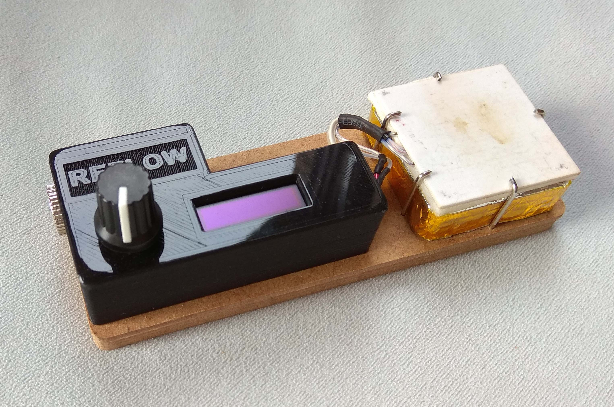
The device is only 13cm long. Heating plate is 4x4cm. Power is 12VDC.

## 2 modes of operation: Manual and Automatic.
In Manual mode preset temperature is maintained. The temperature can be adjusted on the fly.
In Automatic mode the device is following general reflow thermal profile.

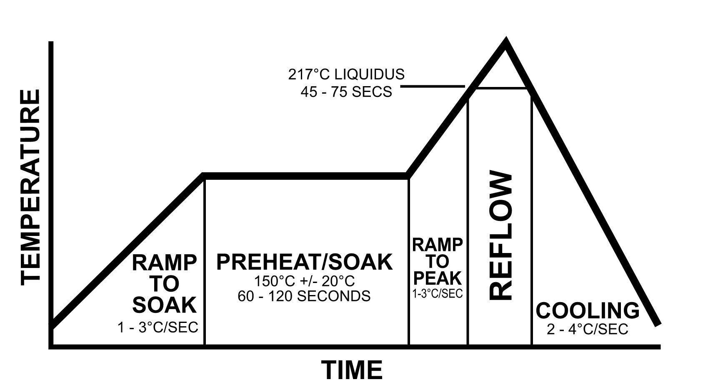
Example of reflow soldering thermal profile (from Wikipedia)

Every parameter can be adjusted (Soak and reflow temperature and time). Preset can be configured and stored in EEPROM and can be adjusted on the fly.

### We will need:
- 1 Heating element like XD-JR80 12V48W
- 1 Thermistor 100K NTC 3950 (from 3D printer)
- 1 Arduino Nano
- 1 Rotary Encoder like EC11
- 1 OLED 128x32 with I2c
- 1 P-Mosfet like AON6403, AON6411, AON7423 or similar.
- And some other smd components
- PCB from OSHPark: https://oshpark.com/shared_projects/yKbu7gQC

I have added to the firmware support for K type thermocouple (MAX31855 or MAX6675), but made no PCB for this. I left it up to your creativity. :)

Controller board (OLED, rotary encoder, mosfet control and thermistor monitor):
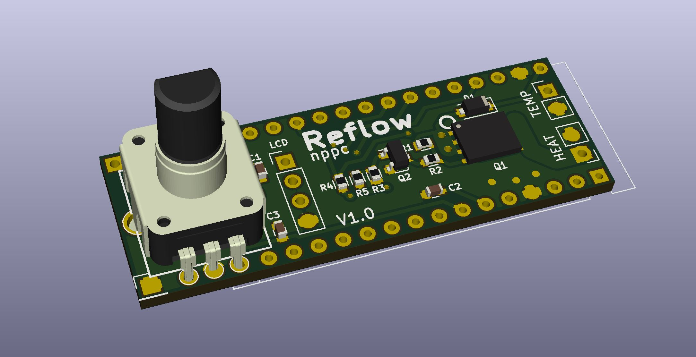
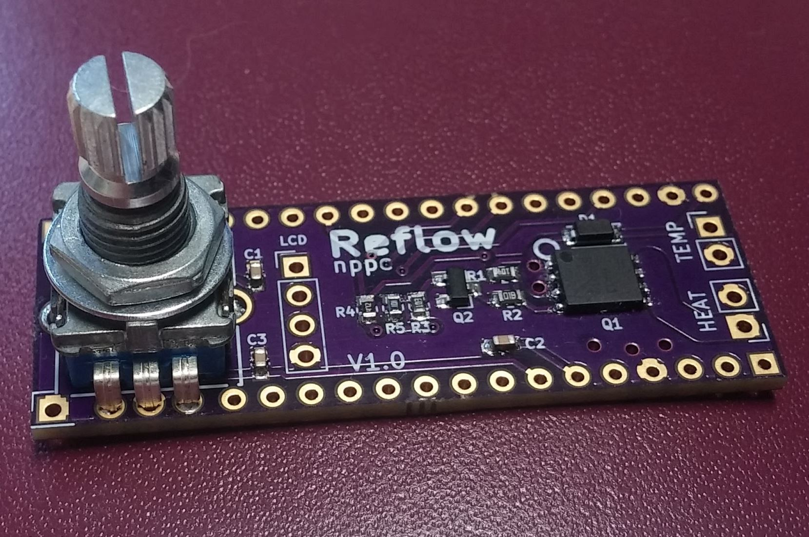

## LCD screens snapshots:
### Start menu 
(choose two presets - manual temperature regulation or automatic reflow)
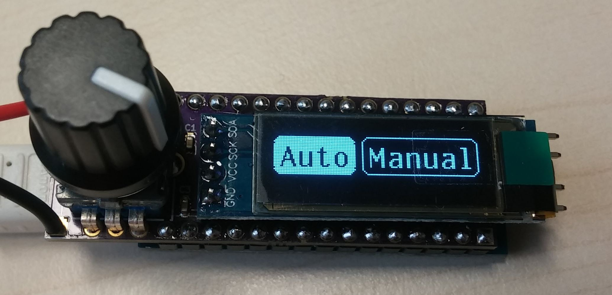

### Manual mode 
- Target temperature is adjustable on the fly. 
- Timer is counting total time while on target temperature.
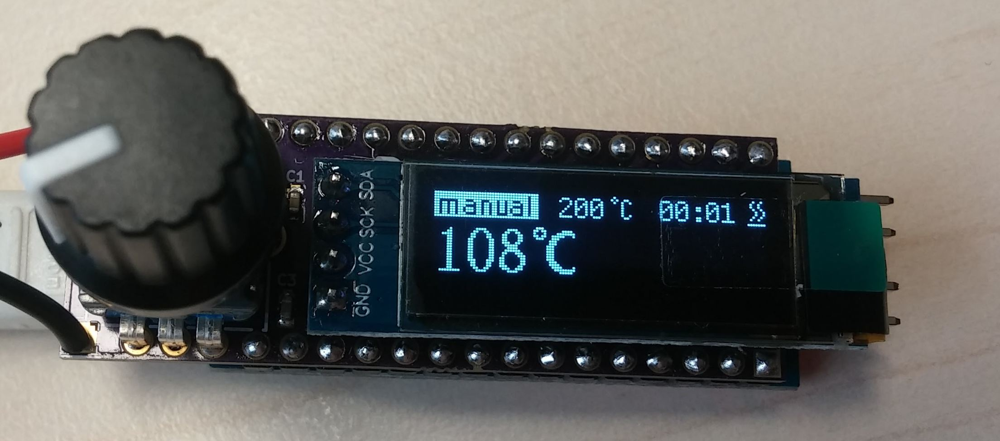

### Automatic Reflow mode
- Indication of current step (soak, reflow, cooling)
- Timer for every step
- Target temperature and time is adjustable on the fly. 

(Ramp to soak step)
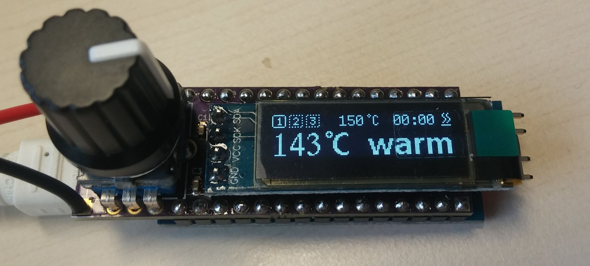
(Soak step - preheating)
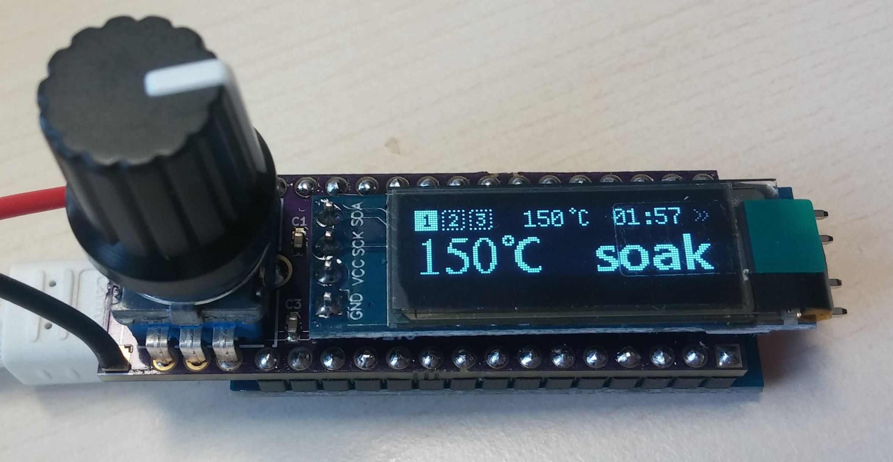
(Ramp to reflow step)
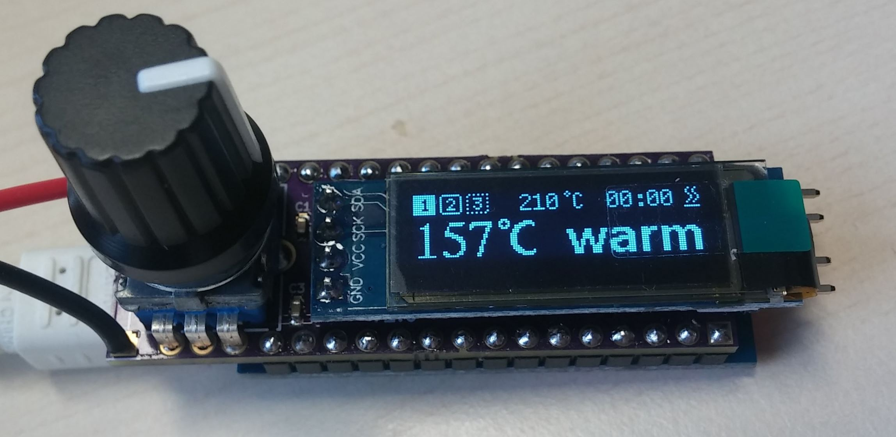
(Reflow step)
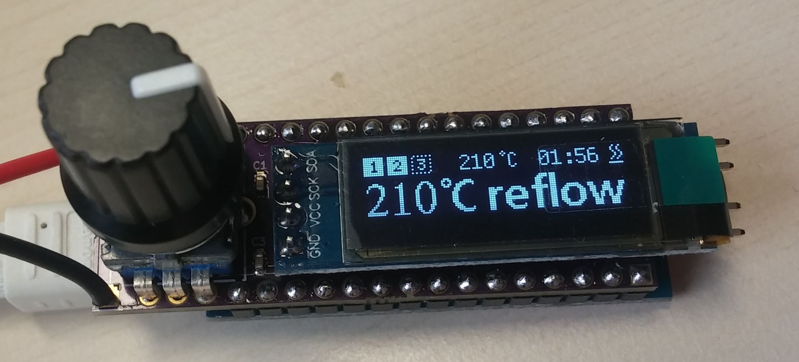
(Cooling down step)
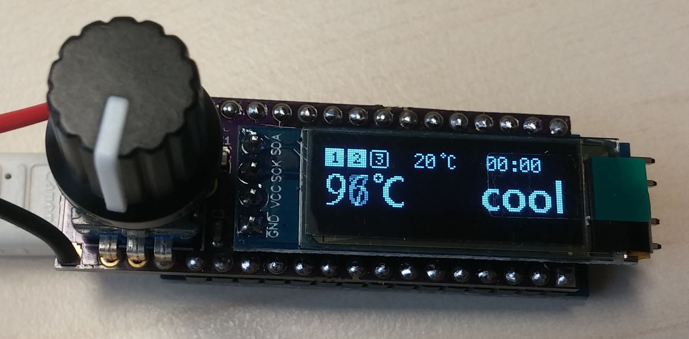

## Configurable parameters
(long button press while in start menu)
- PID P
- PID I
- PID D
- Soak temperature (preheating)
- Soak time (preheating)
- Reflow temperature
- Reflow time
- Target temperature for Manual mode

## Compiling with Arduino
You can use latest Arduino IDE.
And need to include two libraries via Arduino IDE Libraries Manager
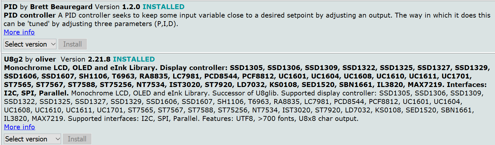

Discussion here: https://www.rcgroups.com/forums/showthread.php?2998269-DIY-reflow-soldering-ceramic-plate